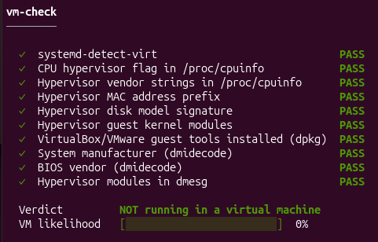
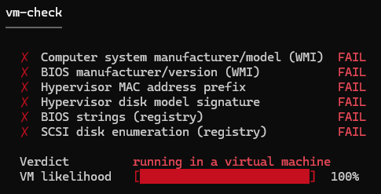
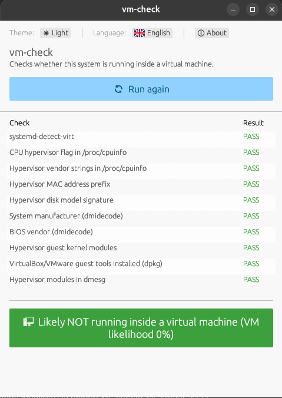
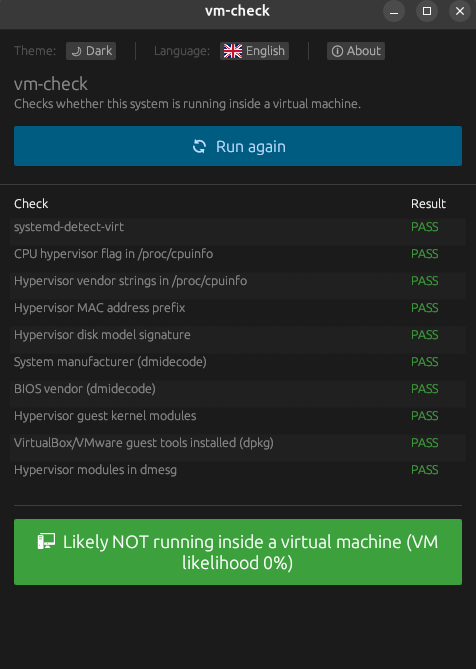
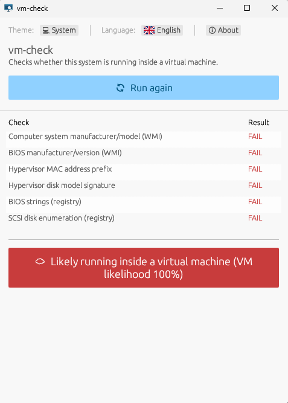

#  vm-check

**[Project page →](https://transfairs.github.io/vm-check/)**

Checks whether the current system is running inside a virtual machine, using a
weighted set of heuristics (CPU flags, `systemd-detect-virt`, MAC address and
disk model signatures, DMI/BIOS vendor strings, kernel modules and guest
tools). Available as a command-line tool and as a cross-platform desktop GUI,
on both Linux and Windows.

## Project layout

This is a Cargo workspace:

- [`vm-check-core`](vm-check-core): the detection engine (a library). All
  platform-specific checks and the confidence-scoring logic live here.
- [`vm-check-cli`](vm-check-cli): the command-line interface (binary `vm-check`).
- [`vm-check-gui`](vm-check-gui): the desktop GUI (binary `vm-check-gui`),
  built with [egui](https://github.com/emilk/egui).

## Installation

### Dependencies

- A [Rust toolchain](https://rustup.rs). That's all you need to build
  `vm-check-cli`.
- Building `vm-check-gui` **on Linux** additionally needs some system
  development packages for the windowing/GUI stack. On Debian/Ubuntu:

  ```sh
  sudo apt install libgtk-3-dev libxkbcommon-dev libxcb-shape0-dev libxcb-xfixes0-dev libxcb-render0-dev
  ```

  These are only needed to *build* the GUI; the resulting binary doesn't
  need `libgtk` at runtime, just a running X11 or Wayland session.
- Building **on Windows** needs no extra system packages beyond the Rust
  toolchain (the MSVC or GNU `x86_64-pc-windows` target, whichever
  `rustup` installed): `cargo build` handles the rest.

### Building from source

```sh
cargo build --release --workspace
```

Binaries are produced at `target/release/vm-check` (CLI) and
`target/release/vm-check-gui` (GUI); on Windows these are `vm-check.exe` and
`vm-check-gui.exe`.

### Pre-built binaries

Each [release](../../releases) has ready-to-run archives attached:
`vm-check-linux-x86_64.tar.gz` and `vm-check-windows-x86_64.zip`. Extract and
run: no installer, nothing to register with the system.

## Usage

### CLI

```sh
vm-check                # run all checks, prompting once if elevated checks are needed
vm-check --no-elevate    # skip checks that need root/sudo (dmesg, dmidecode) entirely
vm-check -y              # don't prompt, run elevated checks automatically
vm-check --json          # machine-readable output for scripting/CI
vm-check -v              # show extra detail (matched strings, skip reasons) per check
```

Exit codes: `0` likely physical, `1` likely a virtual machine, `2` uncertain,
`3` internal error.

On **Windows**, run it the same way from `cmd.exe` or PowerShell:

```powershell
.\vm-check.exe
.\vm-check.exe --json
```

### GUI

Run `vm-check-gui` and click "Run checks". On Windows, double-click
`vm-check-gui.exe` (no console window is needed) or launch it from
PowerShell/`cmd.exe`.

## Elevated / administrator privileges

Only two checks need elevated privileges, and only on Linux: `dmesg` (reading
the kernel ring buffer) and `dmidecode` (which falls back to `sudo` only if
the unprivileged DMI sysfs read fails). Every other check, including all
Windows checks (WMI queries, `HKLM` registry reads), runs fine as a normal
user; **Windows never needs Administrator / UAC elevation for any check.**

- **CLI, Linux:** if any privileged checks apply, `vm-check` asks once
  ("N check(s) need elevated privileges, run them? [Y/n]") and shells out to
  `sudo` only for those specific checks. Use `-y`/`--yes` to skip the prompt
  and proceed, or `--no-elevate` to skip those checks entirely (no `sudo`
  invocation at all).
- **GUI, Linux:** privileged checks are opt-in via a checkbox in the window.
  Since a windowed app can't sensibly show an interactive terminal `sudo`
  prompt, the practical way to include them is to relaunch the whole GUI as
  root, e.g. `sudo vm-check-gui`, and then tick the checkbox.

## Testing

```sh
cargo test --workspace
```

This runs:

- **`vm-check-core`**: unit tests for every detection heuristic (including
  the German translations) against a mocked evidence source
  (`MockLinuxEvidence`/`MockWindowsEvidence`), so no real host/VM state is
  needed, plus tests for `SystemEvidence`'s real file/subprocess I/O against
  the actual machine running the tests.
- **`vm-check-cli`**: unit tests for argument-independent logic
  (`confirm_elevation`, output formatting, exit codes), and integration tests
  in [`vm-check-cli/tests/cli.rs`](vm-check-cli/tests/cli.rs) that spawn the
  compiled `vm-check` binary, since `main()` calls `std::process::exit` and
  can't be exercised in-process.
- **`vm-check-gui`**: unit tests for the background check-running logic and
  the language/theme/persistence logic (`i18n.rs`, `App::from_storage`/`save`
  against a mocked `eframe::Storage`), plus UI tests that drive `App`'s
  rendering through [egui](https://github.com/emilk/egui)'s own in-memory
  `Context::run`, which performs a full immediate-mode layout pass without a
  display or GPU.

CI (`.github/workflows/ci.yml`) runs this test suite plus `cargo fmt --check`
and `cargo clippy -D warnings` on every push, on both Linux and Windows.

### Coverage

```sh
cargo install cargo-llvm-cov
rustup component add llvm-tools-preview
cargo llvm-cov --workspace --summary-only
```

## Screenshots

### CLI

Physical Linux host, every check passes:



Windows VM guest, every check fails:



### GUI

Light theme, physical Linux host | Dark theme, same host | Windows VM guest
:---: | :---: | :---:
 |  | 

