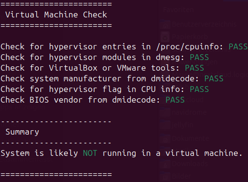

# vm-check
Checks whether the current system is running inside a virtual machine.

## Usage
`chmod u+x vm-check.sh`

`. vm-check.sh`

Reading Kernel Ring Buffer (`dmesg`) requires sudo.

## Screenshots
### VM
Linux Mint running in a VM (QEMU).

### Real System
Script runs under Ubuntu

